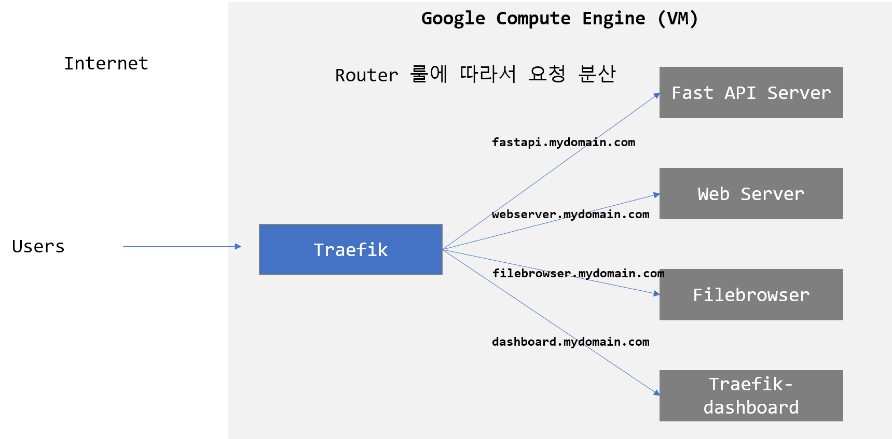

# Fast API를 HTTPS로 띄워보자 (Fast API + Traefik)

현재 맡고있는 딥러닝 관련 프로젝트에서 협력사를 통해서 웹어플리케이션을 개발하고 있고, 딥러닝 핵심 API는 우리가 개발하는 방식으로 협업을 하고 있다. 웹어플리케이션과 딥러닝 API의 연동 테스트를 위해서 GCP를 통해서 테스트용 API 서버를 HTTP를 제공하고 있다. 아직 개발단계여서 일단 HTTP 통신만 생각하고 마지막에 HTTPS를 도입하려고 했으나,  협력사분들이 '혹시 나중에 이슈가 생길지 모르니 미리미리 준비하자'고 채찍질을 해주셔서, 우리 딥러닝 API서버도 HTTPS를 도입하기로 했다. (게으른 저를 잘 이끌어주셔서 감사합니다. 협력사 대표님)


우리 딥러닝 API는 [FastAPI](https://fastapi.tiangolo.com/) 라는 Python 기반 프레임워크로 개발하고 있다. Flask, Django 와 비슷하긴 한데, 개인적으로는 시작하기도 쉽고, 매커니즘도 간단하고, 빠르고, 편하다!! Flask, Django 등 다양한 Pyhton 프레임워크를 써봤던 나로서는 개인적으로 Rest API 를 구축하기 위해서는 Fast API 만큼 간단하고 편한 프레임워크는 없다고 생각한다. 간단한 Backend Rest API 서버를 최소한의 노력으로 구축하고 싶은 분들은 써보시길 강력 추천한다. Fast API가 궁금하신 분들을 위해서 기회가 된다면 따로 Fast API에 대해서 다룰 수 있는 글을 써보도록 하겠다. 우리는 기본적으로 모든 서비스를 Dockerize 해서 사용하고 있으며, Fast API 역시 Dockerize 된 버전을 가지고 있다.


### Fast API + Traefik

Nginx, Apache 같은 웹서버에 인증서를 넣어서 HTTPS를 구축해본 경험은 있지만, Fast API는 해본적이 없어서 일단 검색을 해보았다. 그랬더니 아주 친절하게도 Fast API 개발자가 직접 HTTPS를 구성해본 블로그 글이 있었다! 이 글을 보니 Fast API의 앞단에 Traefik 이라는 Reverse proxy 서비스를 붙여서 HTTPS 를 구성하면 된다고 한다. Traefik 은 Let's Encrypt 를 통한 자동 인증서 발급 및 서비스와 연동도 가능해서 Fast API와 함께 묶기 정말 편해진다. 

[Deploying FastAPI (and other) apps with HTTPS powered by Traefik](https://dev.to/tiangolo/deploying-fastapi-and-other-apps-with-https-powered-by-traefik-5dik)


위 블로그 글을 바탕으로 우리가 해보고자 하는 시나리오를 구현해본다.


### 시나리오와 아키텍처

우리는 mydomain.com 이라는 도메인을 이미 가지고 있다고 가정한다. 이 도메인을 통해 Fast API Server를 비롯한 3개의 서비스를 서브도메인 (Subdomain) 으로 운영해볼 예정이다.

- Subdomains
  - **fastapi.mydomain.com**: Fast API 서버 (Rest API)
  - **webserver.mydomain.com**: Nginx 로 만든 간단한 서버
  - **filebrowser.mydomain.com**: 오픈소스인 웹 기반 Filebrowser로 서버 내의 파일들의 업로드/다운로드/수정 등이 가능하다. 

- **Traefik**이 앞단의 Reverse Proxy 역할을 하게 되고 인터넷으로부터 요청을 받으면 Router 규칙에 따라서 인터넷 요청을 각 서비스로 분배하게 된다.

위의 내용을 정리하면 아래와 같은 아키텍처로 나타내 볼 수 있겠다.


<<<<<<< HEAD:fastapi-traefik/README.md

=======

>>>>>>> 0e8df569d7d57394312754605161027b21742ea1:README.md


### Implementation

구축한 서버환경은 다음과 같다.

- Google Compute Engine (Ubuntu 20.04)

- Docker & Docker compose 이 설치된 상태

  

#### 간단한 FastAPI 어플리케이션 만들기

./app/main.py

```python
from fastapi import FastAPI

app = FastAPI()


@app.get("/")
def read_main():
    return {"message": "Hello World of FastAPI with Traefik"}
```

./app/Dockerfile

```
FROM tiangolo/uvicorn-gunicorn-fastapi:python3.8

COPY ./app /app/
```


### Docker compose files

- docker-compose.traefik.yml

```yaml
services:
  traefik:
    image: traefik:v2.3
    ports:
      - 80:80
      - 443:443
    restart: always
    labels:
      - traefik.enable=true
      - traefik.http.services.traefik-dashboard.loadbalancer.server.port=8080
      - traefik.http.routers.traefik-dashboard-http.entrypoints=http
      # 자신의 Subdomain으로 변경필요
      - traefik.http.routers.traefik-dashboard-http.rule=Host(`dashboard.mydomain.com`)
      - traefik.docker.network=traefik-public
      - traefik.http.routers.traefik-dashboard-https.entrypoints=https
      # 자신의 Subdomain으로 변경필요
      - traefik.http.routers.traefik-dashboard-https.rule=Host(`dashboard.mydomain.com`)
      - traefik.http.routers.traefik-dashboard-https.tls=true
      - traefik.http.routers.traefik-dashboard-https.tls.certresolver=le
      - traefik.http.routers.traefik-dashboard-https.service=api@internal
      - traefik.http.middlewares.https-redirect.redirectscheme.scheme=https
      - traefik.http.middlewares.https-redirect.redirectscheme.permanent=true
      - traefik.http.routers.traefik-dashboard-http.middlewares=https-redirect
    volumes:
      - /var/run/docker.sock:/var/run/docker.sock:ro
      - ./traefik-public-certificates:/certificates
    command:
      - --providers.docker
      - --providers.docker.exposedbydefault=false
      - --entrypoints.http.address=:80
      - --entrypoints.https.address=:443
      # 자신의 이메일로 변경
      - --certificatesresolvers.le.acme.email=admin@xxx.com
      - --certificatesresolvers.le.acme.storage=/certificates/acme.json
      - --certificatesresolvers.le.acme.tlschallenge=true
      - --accesslog
      - --log
      - --api
    networks:
      - traefik-public
networks:
  traefik-public:
    external: true
```

- docker-compose.apps.yml

```yaml
services:
  fastapi:
    build: .
    restart: always
    expose:
      - "80"
    labels:
      - traefik.enable=true
      # Docker내 어플리케이션 서버가 다르다면 포트변경 필요
      - traefik.http.services.app.loadbalancer.server.port=80
      - traefik.http.routers.app-http.entrypoints=http
      # 자신의 Subdomain으로 변경필요
      - traefik.http.routers.app-http.rule=Host(`fastapi.mydomain.com`)
      - traefik.docker.network=traefik-public
      - traefik.http.routers.app-https.entrypoints=https
      # 자신의 Subdomain으로 변경필요
      - traefik.http.routers.app-https.rule=Host(`fastapi.mydomain.com`)
      - traefik.http.routers.app-https.tls=true
      - traefik.http.routers.app-https.tls.certresolver=le
      - traefik.http.middlewares.https-redirect.redirectscheme.scheme=https
      - traefik.http.middlewares.https-redirect.redirectscheme.permanent=true
      - traefik.http.routers.app-http.middlewares=https-redirect
    networks:
      - traefik-public
  webserver:
    image: nginx
    expose:
      - "80"
    labels:
      - traefik.enable=true
      # Docker내 어플리케이션 서버가 다르다면 포트변경 필요
      - traefik.http.services.app2.loadbalancer.server.port=80
      - traefik.http.routers.app2-http.entrypoints=http
      # 자신의 Subdomain으로 변경필요
      - traefik.http.routers.app2-http.rule=Host(`webserver.mydomain.com`)
      - traefik.docker.network=traefik-public
      - traefik.http.routers.app2-https.entrypoints=https
      # 자신의 Subdomain으로 변경필요
      - traefik.http.routers.app2-https.rule=Host(`webserver.mydomain.com`)
      - traefik.http.routers.app2-https.tls=true
      - traefik.http.routers.app2-https.tls.certresolver=le
      - traefik.http.middlewares.https-redirect.redirectscheme.scheme=https
      - traefik.http.middlewares.https-redirect.redirectscheme.permanent=true
      - traefik.http.routers.app2-http.middlewares=https-redirect
    networks:
      - traefik-public
  filebrowser:
    image: filebrowser/filebrowser
    expose:
      - 80
    labels:
      - traefik.enable=true
      # Docker내 어플리케이션 서버가 다르다면 포트변경 필요. (현재 filebrowser는 80으로 서비스된다)
      - traefik.http.services.app3.loadbalancer.server.port=80
      - traefik.http.routers.app3-http.entrypoints=http
      # 자신의 Subdomain으로 변경필요
      - traefik.http.routers.app3-http.rule=Host(`filebrowser.mydomain.com`)
      - traefik.docker.network=traefik-public
      - traefik.http.routers.app3-https.entrypoints=https
      # 자신의 Subdomain으로 변경필요
      - traefik.http.routers.app3-https.rule=Host(`filebrowser.mydomain.com`)
      - traefik.http.routers.app3-https.tls=true
      - traefik.http.routers.app3-https.tls.certresolver=le
      - traefik.http.middlewares.https-redirect.redirectscheme.scheme=https
      - traefik.http.middlewares.https-redirect.redirectscheme.permanent=true
      - traefik.http.routers.app3-http.middlewares=https-redirect
    networks:
      - traefik-public
networks:
  traefik-public:
    external: true
```


### Run

먼저 Docker 네트워크를 만들어주자.
<<<<<<< HEAD:fastapi-traefik/README.md

```
docker network create traefik-public
```

그다음 서비스들을 올려주자.
=======
>>>>>>> 0e8df569d7d57394312754605161027b21742ea1:README.md

```
docker network create traefik-public
```

<<<<<<< HEAD:fastapi-traefik/README.md


### Test

모든 서비스들이 정상적으로 잘 올라갔는지 확인해본다. 우리가 띄운 3개 + traefik 의 Dashboard 가 인증서 문제없이 잘 접속되면 된다. **https://**로 접속해야 함을 잊지 말자.

=======
그다음 서비스들을 올려주자.

```
docker-compose -f docker-compose.traefik.yml up -d
docker-compose -f docker-compose.apps.yml up -d
>>>>>>> 0e8df569d7d57394312754605161027b21742ea1:README.md
```
https://fastapi.mydomain.com
https://webserver.mydomain.com
https://filebrowser.mydomain.com # ID/PW: admin/admin
httsp://dashboard.mydomain.com # Traefik Dashboard
```


### 마치며

Fast API의 개발자의 Github 코드를 보면 Basic HTTP Auth를 하는 등 (브라우저에서 아이디, 패스워드로 로그인이 필요함) 나에게는 직접적으로 필요가 없는 부분은 없앴다. 본 예제에서는 Traefik Dashboard까지 Basic Auth 기능을 없앴지만 이 Dashboard는 관리자만 들어가야 하니 원래는 Basic Auth 를 넣는게 좋을 듯 하다. 이건 위에서 공유한 개발자의 블로그를 보고 따라해 보시길... 

자신의 Fast API이 잘 Dockerize 되어잇고, 도메인만 있다면, Traefik을 통해 Let's Encrypt 로 인증서 발급까지 자동으로 되니 정말 편한 Deploy manifest 파일들을 구성해볼 수 있는 좋은 기회였다. 위에서 소개한 소스코드는 여기에서 제공받을 수 있다. 나의 경우와 같이 Fast API로 HTTPS 서비스를 검토하시는 분들께 많은 도움이 되셨길 바란다.


### Test

모든 서비스들이 정상적으로 잘 올라갔는지 확인해본다. 우리가 띄운 3개 + traefik 의 Dashboard 가 인증서 문제없이 잘 접속되면 된다. **https://**로 접속해야 함을 잊지 말자.

```
https://fastapi.mydomain.com
https://webserver.mydomain.com
https://filebrowser.mydomain.com # ID/PW: admin/admin
httsp://dashboard.mydomain.com # Traefik Dashboard
```


### 마치며

Fast API의 개발자의 Github 코드를 보면 Basic HTTP Auth를 하는 등 (브라우저에서 아이디, 패스워드로 로그인이 필요함) 나에게는 직접적으로 필요가 없는 부분은 없앴다. 본 예제에서는 Traefik Dashboard까지 Basic Auth 기능을 없앴지만 이 Dashboard는 관리자만 들어가야 하니 원래는 Basic Auth 를 넣는게 좋을 듯 하다. 이건 위에서 공유한 개발자의 블로그를 보고 따라해 보시길... 

자신의 Fast API이 잘 Dockerize 되어잇고, 도메인만 있다면, Traefik을 통해 Let's Encrypt 로 인증서 발급까지 자동으로 되니 정말 편한 Deploy manifest 파일들을 구성해볼 수 있는 좋은 기회였다. 위에서 소개한 소스코드는 여기에서 제공받을 수 있다. 나의 경우와 같이 Fast API로 HTTPS 서비스를 검토하시는 분들께 많은 도움이 되셨길 바란다.


